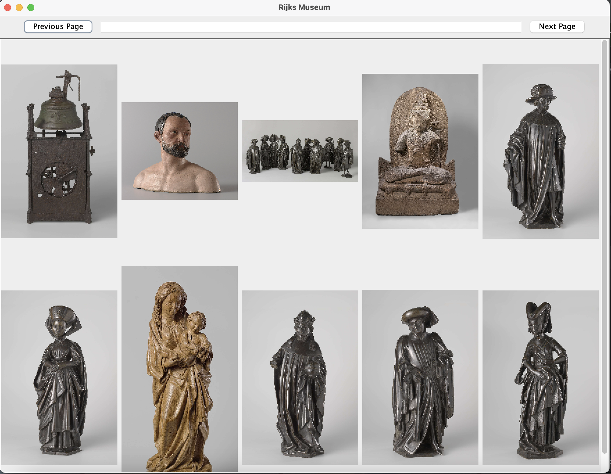
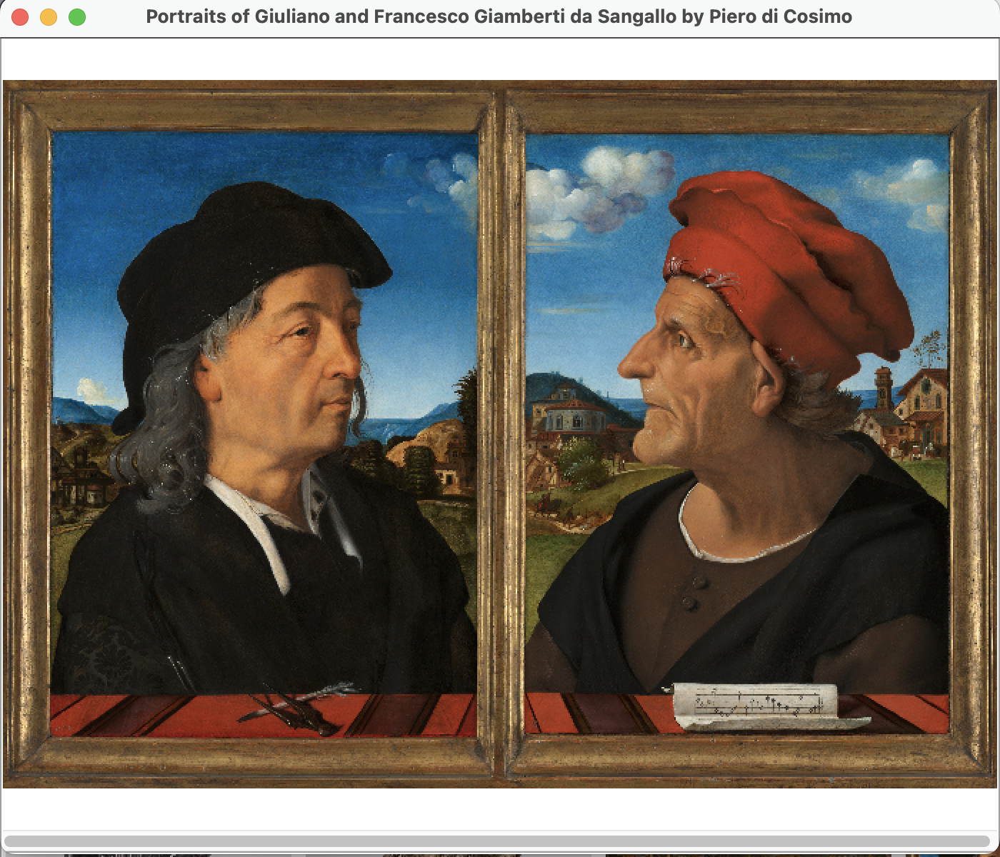

# Rijks Museum

This project is an application that retrieves the images
from the Rijks Museum using Rijks Museum API. Specific
paintings can be searched for and when you roll over a 
painting with your mouse it will tell you more about the
image. When the image is clicked on, the image will open 
up in a new window with the title of the painting and the
author as the title of the frame.

### Links
[Tooltip](https://docs.oracle.com/javase%2Ftutorial%2Fuiswing%2F%2F/components/tooltip.html)\
[ClickListener](https://stackoverflow.com/questions/5260462/can-i-add-an-action-listener-to-a-jlabel/34614434#34614434)\
[JScrollPane](https://docs.oracle.com/javase%2Ftutorial%2F/uiswing/components/scrollpane.html)\
[Rijks Museum](https://www.rijksmuseum.nl/en)

### Technologies
[Rijks API](https://data.rijksmuseum.nl/object-metadata/api/)

